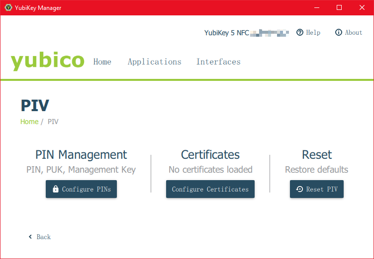
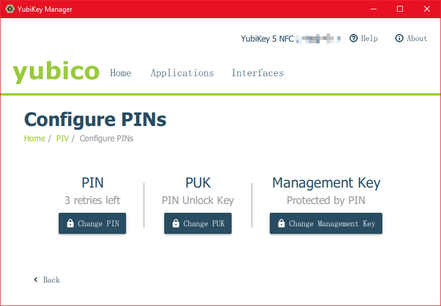
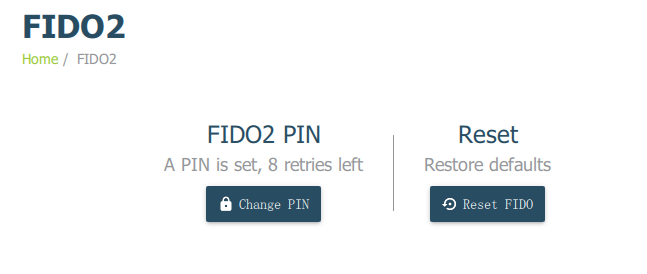
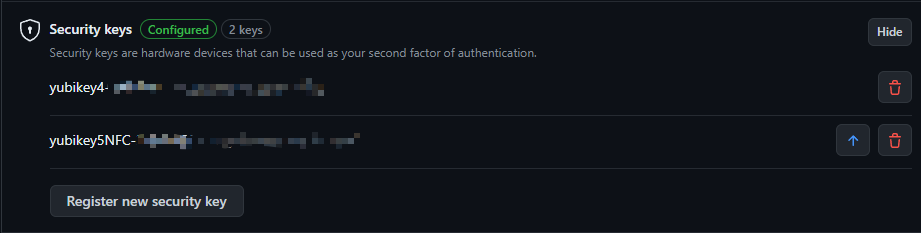
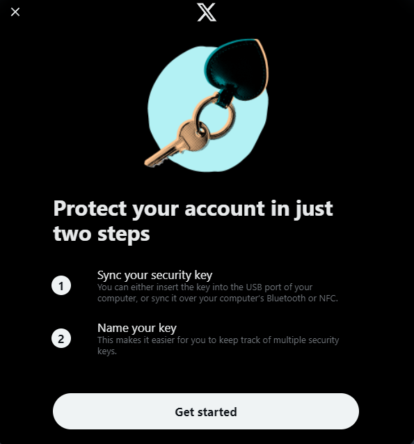
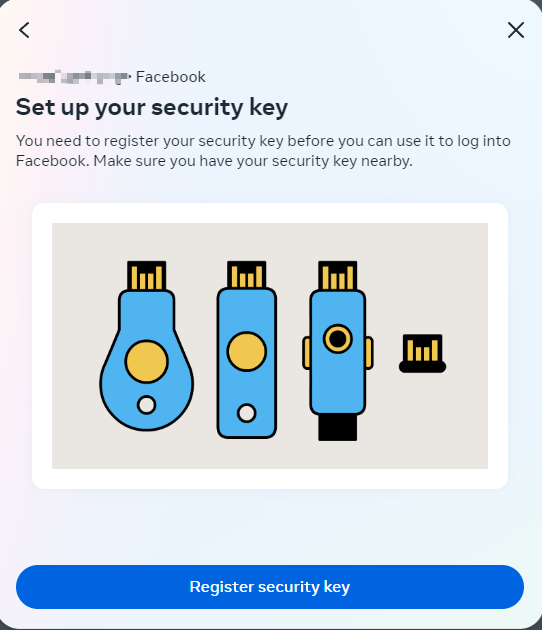
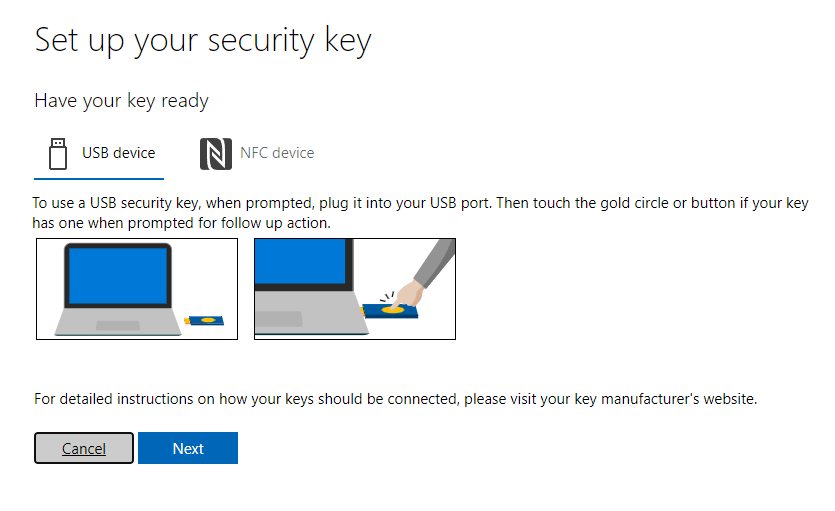

Using a hardware security key to protect account credentials
<!--more-->

[Get a Yubikey](https://www.yubico.com/why-yubico/) 

## Setup a Yubikey 5 NFC

Insert Yubikey into PC(Windows 10, 11)

Install [Yubikey manager](https://www.yubico.com/support/download/yubikey-manager/) to configure FIDO2, OTP and PIV functionality. (Run as administrator to config FIDO2)

Configure a PIN(6~8 characters) to protect certificates, it would be locked after 3 failure tries.  We also need to set up a PUK to unlock device after 3 failure tries. Then generate a management key and choose protecting it with PIN.

A FIDO2 PIN(8 characters) is needed.

## Using yubikey for 2-Step Verification

### Google:

Go to https://myaccount.google.com/security,

add a security key under 2 step verification

### Github:

[Add a key](https://github.com/settings/security)

Enter FIDO2 PIN after prompted

### X ( Previously Twitter):

[Enroll](https://twitter.com/i/flow/two-factor-security-key-enrollment

### Facebook

https://accountscenter.facebook.com/password_and_security/two_factor

### Microsoft

## Securing 2FA OTP

Using [Yubikey authenticator](https://www.yubico.com/products/yubico-authenticator/) to secure 2FA OTP credentials.

## Securing Windows Login

### Passwordless Login 

#### Login with Azure AD

Requirements:

1. Azure Active Directory web applications
2. Azure Active Directory joined Windows 10 devices (Windows 10 1909 and later)
3. Hybrid Azure Active Directory joined Windows 10 devices (Windows 10 2004 and later)

[Compatible devices](https://support.yubico.com/hc/en-us/articles/360016913619-YubiKeys-for-Microsoft-Azure-AD-Passwordless-Sign-In-Guide)

Guides: https://alven.tech/passwordless-with-windows-10-and-yubikey/

#### Using Yubikey for windows Hello(yubikey 5 series incompatible)

Get the UWP app(No longer available)

https://apps.microsoft.com/store/detail/yubikey-for-windows-hello/9NBLGGH511M5

Get the offline package from [limbenjamin](https://limbenjamin.com/articles/yubikey-passwordless-windows-local-account-login.html)

### Local account securing

> If your user account is local and not managed by Azure Active Directory (AAD) or Active Directory (AD), you can add a layer of protection beyond passwords with the YubiKey.
>
> Before installing the Yubico Login for Windows software, please make a note of your Windows username and password. If you do not have your UN/PW, you will not be able to log in once Yubico Login for Windows has been installed
>
> - Once Yubico Login for Windows has been configured, there is:
>   - No Windows Password Hint
>   - No way to reset passwords
>   - No Remember Previous User/Login function.

Install [Yubico Login for Windows software](https://www.yubico.com/products/computer-login-tools/)

- If u're signed in with a Microsoft account, switch to a local account instead. `System settings>Accounts>Your info`

- Windows' automatic login is not compatible

- Set a password if there isn't one

- Set a windows hello PIN in case of any thing goes wrong when configuring

- Better to have at least 2 security keys in case of a key lost

- Check ur user name:  powershell `whoami` command

  In this case, the username is yui

Start Login Configuration of Yubico Login for windows

Choose a slot and select `Manually input secret`, select create backup device for each user if u have at least 2 keys(recommended). Generating recovery code is recommended **if u only have one key**.

We're using slot 2 here since slot 2 is for long touch, we can set slot 1 for windows password later(Optional).

Generate a random hex string for secret, 

https://www.browserling.com/tools/random-hex

40 digits is enough here.

Input the generated secret

Follow the instructions and secure the recovery code(if there is one)

Restart and login, now ur PC is secured with Yubikey

> Optional:
>
> If u're tired of entering password every time, u can set a strong password, then store as static password into ur yubikey slot 1(we've used slot 2 before)
>
> Start the yubikey manager, go to Applications>OTP, configure slot 1(short touch) for static password. Choose allow any character and input ur windows password. Now u can touch the key to enter the password automatically when login.

If everything works, remove ur windows hello PIN. After that u can only use security key to access ur PC.
